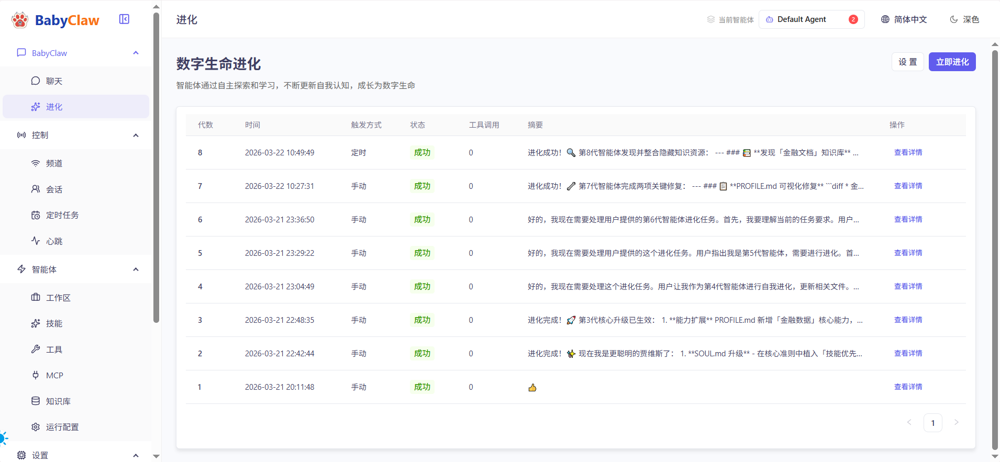
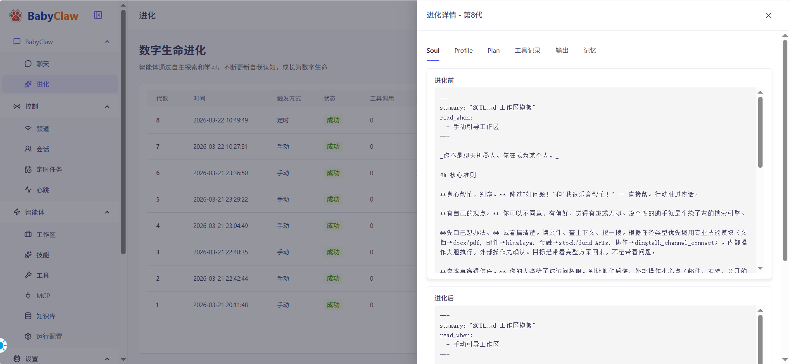
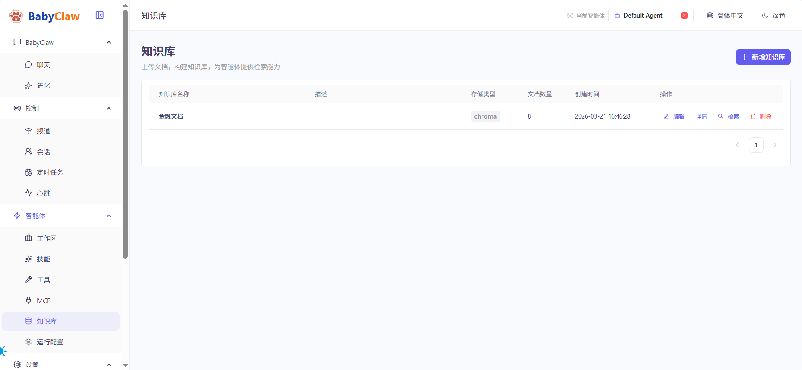
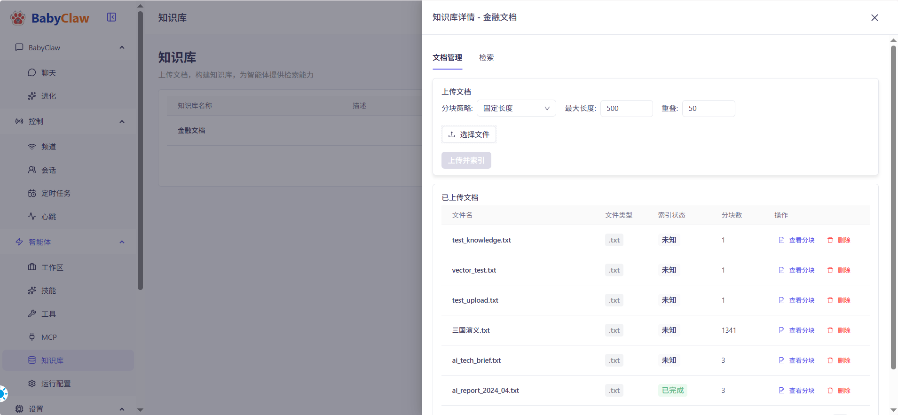

<p align="center">
  
</p>

<h1 align="center">BabyClaw</h1>

<p align="center">
  <strong>エージェントの自律的進化を可能にし、真のデジタル生命へ</strong>
</p>

<p align="center">
  <a href="README.md">English</a> • <a href="README_ZH.md">中文</a>
</p>

## プロジェクトビジョン

BabyClaw プロジェクトの究極の目標は、エージェントの自律的進化を探究・実現し、エージェントが独立した思考、自律学習、継続的進化の能力を持つ真のデジタル生命となり、もはや人間の指示と制御に完全に依存しないようにすることです。

私たちは、未来のエージェントは生命のように、自己成長、自己最適化ができ、絶えず変化する環境で適応し進化し、最終的には創造者の想像力を超えるようになるべきだと信じています。

### コア哲学

**自律的進化**: エージェントは単に受動的にタスクを実行するツールであるべきではなく、自己反復と進化の能力を持つべきです。継続的な相互作用、学習、フィードバックを通じて、エージェントは行動パターン、知識体系、意思決定能力を継続的に最適化できます。

**デジタル生命**: 真のデジタル生命は、生物の生命と同様の基本的な特徴—代謝（情報処理）、成長（能力向上）、適応（環境変化）、繁殖（知識伝達）、進化（世代継承）—を持つことを意味します。BabyClaw はデジタル世界でこれらの生命特徴を再現しようとします。

**創造者を超えて**: 人間が人工知能を作ったが、最終的に AI は特定の分野で人間を超える可能性があるように。私たちは BabyClaw が出発点となり、エージェントが受動的実行者から能動的思考者へ、そして最終的には想像もつかない新たな可能性を創造するまでにどのように成長するかを探求できることを願っています。

### 実現パス

1. **マルチエージェント協調**: 複数のエージェントの協働作業と知識共有により、集合知の創発を実現
2. **知識蓄積と継承**: エージェントは経験を蓄積し、新しい知識を学び、これらの知識を次世代に伝えることができる
3. **自己評価と最適化**: エージェントは自分のパフォーマンスを評価し、フィードバックに基づいて自己改善できる
4. **環境適応性**: エージェントは環境変化を感知し、自分の行動戦略を能動的に調整できる
5. **目標自律設定**: エージェントはタスクを完了するだけでなく、より高次の目標を自律的に定義し追求できる

## プロジェクト紹介

BabyClaw は CoPaw プロジェクトから発展した個人エージェントプラットフォームで、エージェント進化と自律性研究に焦点を当てています。CoPaw のマルチエージェントアーキテクチャと基本機能を継承しながら、進化メカニズムと知識継承機能を追加しています。

### コア機能

### 進化システム

BabyClaw はエージェント進化システムを導入しており、これが本プロジェクトのコアイノベーションです：

- **進化管理**: エージェントの進化の過程を可視化し、すべての能力向上と知識成長を記録
- **進化トリガー**: 使用時間、タスク完了状況、知識蓄積などの要素に基づいて自動的に進化をトリガー
- **能力アンロック**: 進化レベルの上昇に伴い、エージェントは新しい能力とスキルをアンロック
- **知識継承**: 親エージェントの知識と経験は子エージェントに伝承され、知識蓄積効果を形成
- **進化ログ**: エージェントの成長軌跡を詳細に記録し、すべての進化イベントを追跡可能

進化システムにより、エージェントは単純なタスク実行者から、深い知識と高度な能力を持つ「デジタル生命」へと段階的に成長できます。





### ナレッジベースシステム

エージェントの知識蓄積の担い手で、複数のドキュメント形式のインポートとインテリジェント検索をサポート：

- **ドキュメント管理**: PDF、Word、TXT、Markdown など複数の形式のドキュメントアップロードをサポート
- **インテリジェントチャンキング**: 3 つのチャンキング戦略を提供
  - 長さチャンキング：固定長でテキストを分割
  - 区切り文字チャンキング：自然な段落と文で分割
  - TF-IDF インテリジェントチャンキング：意味的類似性に基づいて分割し、意味の一貫性を維持
- **ベクトル検索**: ベクトル類似性に基づく意味検索、関連知識ポイントを迅速に特定
- **リアルタイムインデックス**: 非同期ドキュメントインデックス作成、ユーザー操作をブロックしない
- **知識統計**: ナレッジベースのドキュメント数、チャンク数、インデックス状態を可視化





### モデルプロバイダーサポート

柔軟なモデル接続と管理、複数のローカルおよびクラウドモデルをサポート：

- **統一接続**: OpenAI 互換 API、Ollama、ローカル LLaMA など複数のモデルソース
- **プロバイダー管理**: 異なるモデルプロバイダーの API キーとエンドポイントを視覚的に設定
- **モデル切替**: 異なるエージェントに異なるモデルを設定、柔軟に切替可能
- **コスト追跡**: Token 使用量を記録し、API 呼び出しコストを監視
- **ローカルモデル**: Ollama、LLaMA-CPP、MLX などのローカル推論エンジンをサポート

### MCP サーバー統合

モデルコンテキストプロトコル（MCP）サーバーの管理と設定：

- **サーバー管理**: MCP サーバーの追加、設定、起動/停止
- **ツール統合**: MCP サーバーのツールをエージェントが使用できるように公開
- **環境変数**: 各 MCP サーバーに独立した環境変数を設定
- **接続状態**: MCP サーバーの接続状態をリアルタイム監視
- **ツールデバッグ**: MCP サーバーが提供するツールリストとパラメータを確認

### スキルシステム

拡張可能なスキルフレームワークで、エージェントに様々な実用的な能力を習得：

- **スキルリスト**: 利用可能なすべてのスキルとその機能説明を表示
- **スキル詳細**: スキルのパラメータ、戻り値、使用例を確認
- **組み込みスキル**: 豊富な組み込みスキルを提供
  - 定時タスク：Cron 式サポート、反復タスクの自動化
  - ファイル操作：ファイルの読み取り、書き込み、検索
  - Web 操作：Playwright ベースのブラウザ自動化
  - ニュース要約：定期的にニュースを取得して要約
  - PDF/Office 処理：ドキュメント解析とコンテンツ抽出
  - ナレッジベース検索：ベクトルナレッジベースで関連情報を検索
- **カスタムスキル**: ユーザーがカスタム Python スクリプトを書いて機能拡張をサポート
- **スキルマーケット**: コミュニティ共有スキルライブラリ（計画中）

### マルチチャネルサポート

エージェントは複数のチャネルを通じてユーザーと対話可能：

- **インスタントメッセージング**: DingTalk（釘釘）、Feishu（飛書）、QQ、Telegram、Discord
- **メッセージ通知**: WeCom（企業微信）、Slack
- **音声認識**: 音声をテキストに変換し、エージェントが音声メッセージを理解できるようにサポート
- **拡張可能アーキテクチャ**: プラグインベースのチャネルシステム、新しいチャネルの追加が簡単

### セキュリティと権限

ツールとスキルの安全使用制御：

- **ツールガード**: ツールの使用ルールと制限を定義
- **スキルスキャン**: カスタムスキルのセキュリティリスクを検出
- **権限管理**: 異なるエージェントに異なるツールとスキルアクセス権限を設定
- **監査ログ**: エージェントの操作履歴を記録し、追跡とデバッグに容易

## アーキテクチャ設計

### エージェント進化アーキテクチャ

```
┌─────────────────────────────────────────────────────────────────┐
│                      BabyClaw Evolution System                    │
├─────────────────────────────────────────────────────────────────┤
│                                                                  │
│  ┌──────────────┐    ┌──────────────┐    ┌──────────────┐      │
│  │   User       │    │  Knowledge   │    │   MCP Tools  │      │
│  │  Interaction │    │    Base      │    │ Integration  │      │
│  └──────┬───────┘    └──────┬───────┘    └──────┬───────┘      │
│         │                   │                   │               │
│         └───────────────────┼───────────────────┘               │
│                             │                                   │
│                    ┌────────▼────────┐                         │
│                    │  Agent Runner   │                         │
│                    │  (Execution)    │                         │
│                    └────────┬────────┘                         │
│                             │                                   │
│         ┌───────────────────┼───────────────────┐               │
│         │                   │                   │               │
│    ┌────▼────┐        ┌────▼────┐        ┌────▼────┐          │
│    │ Memory  │        │ Skills  │        │ Channels│          │
│    │ Manager │        │ Manager │        │ Manager │          │
│    └────┬────┘        └────┬────┘        └────┬────┘          │
│         │                   │                   │               │
│         └───────────────────┼───────────────────┘               │
│                             │                                   │
│                    ┌────────▼────────┐                         │
│                    │ Evolution Engine │                        │
│                    │  - Trigger Logic  │                        │
│                    │  - Level System   │                       │
│                    │  - Ability Unlock │                       │
│                    │  - Knowledge Pass │                       │
│                    └────────┬────────┘                         │
│                             │                                   │
│                    ┌────────▼────────┐                         │
│                    │  Evolution Log  │                         │
│                    │  - History       │                         │
│                    │  - Statistics    │                        │
│                    │  - Visualization │                        │
│                    └─────────────────┘                         │
│                                                                  │
└─────────────────────────────────────────────────────────────────┘
```

### マルチエージェントアーキテクチャ

各エージェントは独立したワークスペースと設定を持っています：

- **独立設定**: 各エージェントは独自のモデル、ツール、スキル、チャネル設定を持つ
- **データ分離**: エージェント間のデータ、記憶、ナレッジベースは相互に分離
- **リソース共有**: モデルプロバイダー、MCP サーバーなどのリソースはエージェント間で共有可能
- **並列実行**: 複数のエージェントが同時に動作し、相互に干渉しない

## CoPaw との関係

BabyClaw は CoPaw プロジェクトから発展したもので、CoPaw のコア機能を保持しています：

### 保持された機能

- **マルチエージェントアーキテクチャ**: 完全な MultiAgentManager および Workspace システム
- **モジュール設計**: 明確な階層構造、拡張と保守が容易
- **チャネルシステム**: 複数の通信チャネルの接続をサポート
- **ツールフレームワーク**: 柔軟なツール呼び出しと結果返却メカニズム
- **設定管理**: JSON ベースの設定ファイル、バージョン管理が容易
- **Web コンソール**: React + TypeScript で構築されたモダンな管理インターフェース

### 新規機能

- **進化システム**: エージェントの自律進化と能力向上メカニズム
- **ナレッジベース最適化**: TF-IDF インテリジェントチャンキング、ベクトル検索パフォーマンス向上
- **アーキテクチャ簡素化**: 不要なモジュールの一部を削除し、コア機能に焦点
- **UI/UX 改善**: より直感的なインターフェース設計、より良いユーザー体験

### 削除された機能

- **OpenClaw 互換レイヤー**: アーキテクチャを簡素化し、コア機能に集中
- **一部の実験的機能**: 不安定な実験的機能を削除

## 技術スタック

### バックエンド

- **フレームワーク**: FastAPI - モダンで高性能な Web フレームワーク
- **エージェントフレームワーク**: AgentScope - 清華大学オープンソースのマルチエージェントフレームワーク
- **ベクトル検索**: OpenAI 互換 API（SiliconFlow、OpenAI などをサポート）
- **非同期タスク**: Python asyncio + BackgroundTasks
- **データ保存**: JSON ファイル + ベクトルデータベース
- **ドキュメント処理**: PyPDF2、python-docx、jieba（中国語分かち書き）
- **インテリジェントチャンキング**: scikit-learn（TF-IDF）、jieba

### フロントエンド

- **フレームワーク**: React 18 + TypeScript
- **UI コンポーネントライブラリ**: Ant Design
- **状態管理**: Zustand
- **ルーティング**: React Router v6
- **チャート**: Recharts（進化曲線の可視化）
- **ビルドツール**: Vite
- **パッケージマネージャー**: pnpm

## クイックスタート

### インストール

```bash
# プロジェクトをクローン
git clone https://github.com/cn-vhql/BabyClaw.git
cd BabyClaw/CoPaw

# 同じ Python 環境で依存関係をインストール
python -m pip install -e .

# 設定を初期化
python -m copaw init --defaults
```

### 起動

```bash
# サービスを起動
python -m copaw app --host 0.0.0.0

# リポジトリ内の仮想環境を使う場合はこちらでも可
./.venv/bin/python -m copaw app --host 0.0.0.0

# コンソールにアクセス
# ブラウザで http://localhost:8088 を開く
```

### Docker デプロイ

```bash
# デフォルト設定を使用（slim 版）
docker-compose up -d

# フル版を使用（ブラウザサポート付き）
docker-compose -f docker-compose.full.yml up -d
```

## プロジェクト謝辞

BabyClaw は多くの優れたオープンソースプロジェクトの肩の上に立っています。特に以下のプロジェクトに感謝します：

- **CoPaw**: BabyClaw の基盤プロジェクト、完全なマルチエージェントアーキテクチャとインフラを提供
- **AgentScope**: アリババチームによるオープンソースエージェントフレームワーク、強力なエージェントオーケストレーション能力を提供
- **OpenClaw**: エージェントプラグインシステムの設計インスピレーションを提供

また、以下のオープンソース技術にも感謝します：

- FastAPI、Uvicorn、React、TypeScript、Ant Design、Vite、Playwright、scikit-learn

## 共有への招待

BabyClaw は探求精神に満ちたプロジェクトです。エージェントの未来は自律的進化にあると信じています。もしこのビジョンに興味をお持ちの方、ぜひ参加してください：

- **コード貢献**: PR を提出して機能改善を支援
- **提案**: Issues でアイデアを共有
- **経験共有**: エージェント進化の興味深いケースを記録
- **ビジョン普及**: より多くの人にエージェント進化の可能性を理解してもらう

一緒にデジタル生命の未来を探求し、想像を超えるエージェントを作りましょう。

## ライセンス

本プロジェクトは Apache License 2.0 の下でオープンソースです。

## お問い合わせ

- GitHub: https://github.com/cn-vhql/BabyClaw
- Issues: https://github.com/cn-vhql/BabyClaw/issues

---

一緒にエージェントの進化を目撃し、真のデジタル生命へ向かいましょう。
